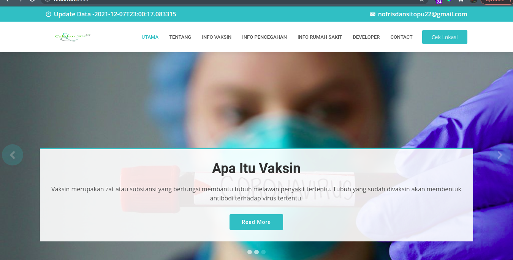
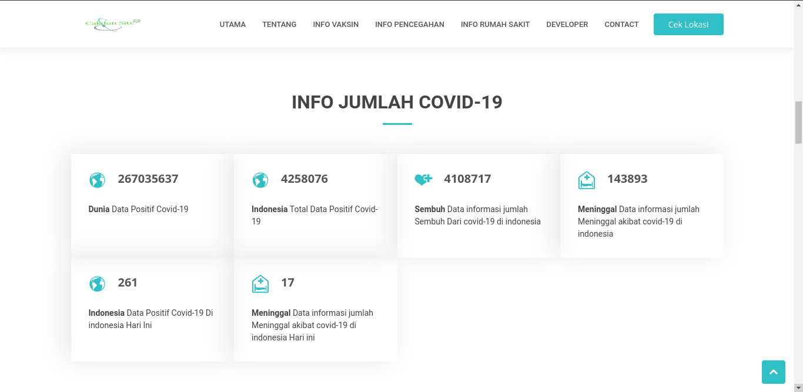
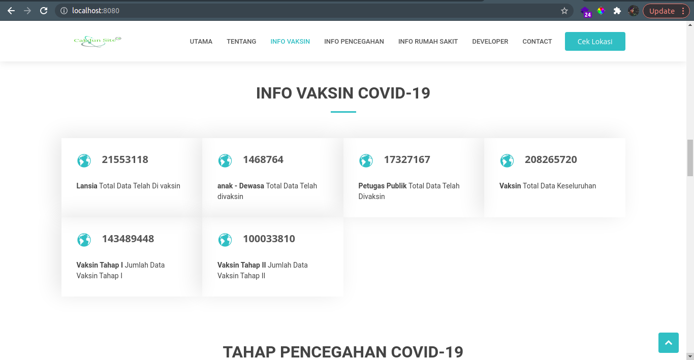
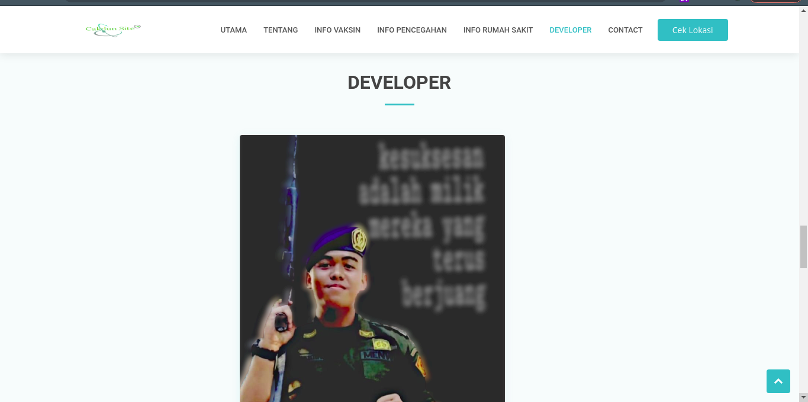

# sistem_informasi_covid_19
Aplikasi Sistem Informasi Covid 19

# Tentang Aplikasi
Aplikasi Sistem Informasi Covid 19 merupakan salah satu aplikasi berbasis website yang berfungsi untuk memberikan informasi seputar covid 19 kepada masyarakat luas seperti : `Informasi Rekomendasi Vaksin`. , `Jumlah Terpapar Covid `. dan `Informasi Jumlah Vaksin`.

# Fitur Aplikasi
<ul>
<li>Rest Api</li>

</ul>

# Teknologi Yang digunakan
<ul>
<li>Boostrapmade</li>
<li>Javascript</li>
</ul>


# Instalasi
Untuk mengunduh aplikasi silahkan clone menggunakan git dengan perintah dibawah
```
git clone https://github.com/Nofrisdan/sistem_informasi_covid_19
```

:warning: **Silahkan Menghubungi Saya jika mengalami masalah dalam proses instalasi dan jalannya aplikasi email isdansitopu@gmail.com**:


# Gambar Aplikasi 









